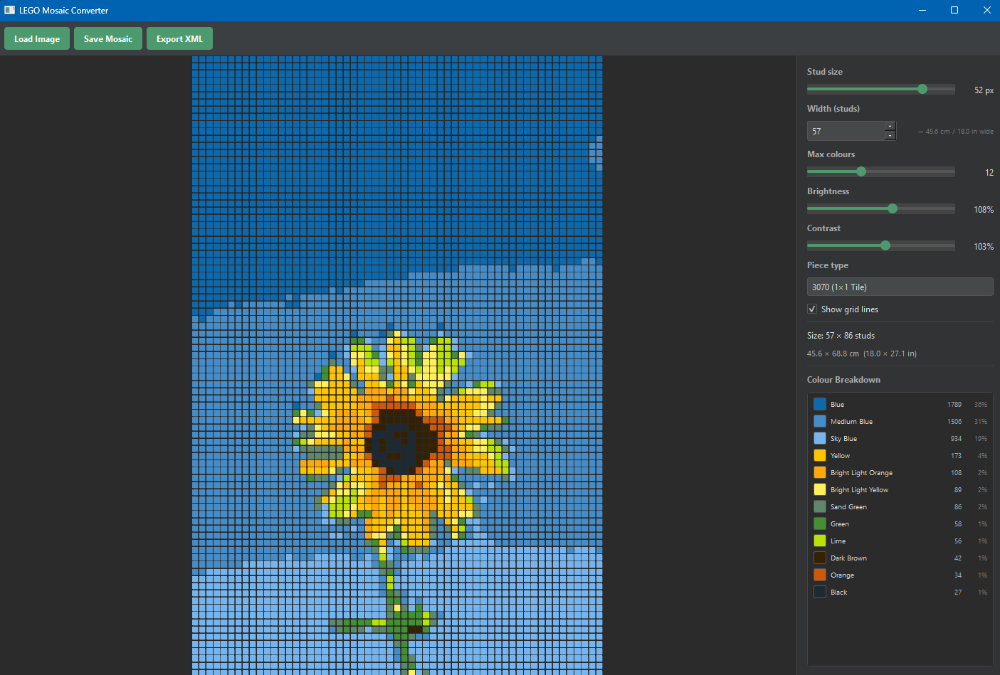
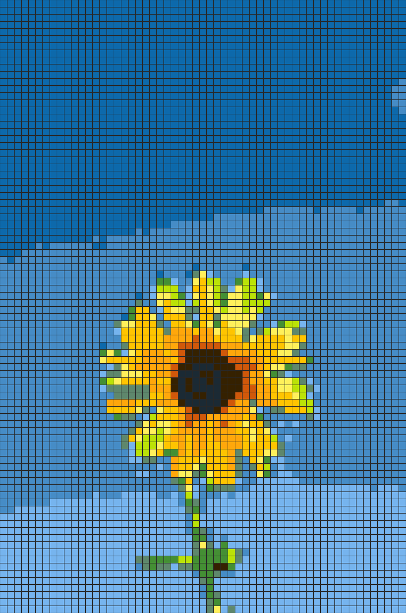
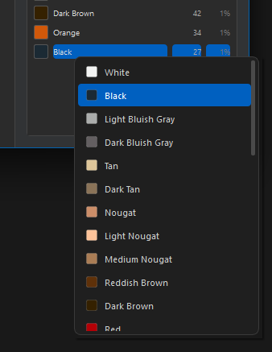
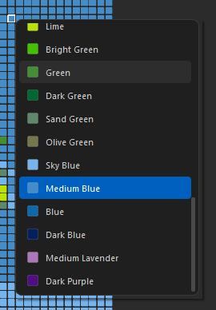

# LEGO Mosaic Converter

A desktop GUI application that converts any photo into a buildable LEGO mosaic — with live controls, colour editing, real-world size calculations, and a BrickLink-ready shopping list.



---

## Features

- **Live preview** — drag any slider and the mosaic updates within milliseconds
- **LAB colour matching** — perceptual colour space gives more natural results than raw RGB distance
- **33-colour LEGO palette** — curated set of commonly available LEGO colours
- **Three piece types** — 1×1 Tile (3070), 1×1 Plate (3024), 1×1 Round Plate (98138)
- **Adjustable stud width** — set exact mosaic width in studs; height is derived from the aspect ratio
- **Colour budget** — limit how many distinct colours appear (2–30)
- **Brightness & contrast controls** — tweak the source image before matching
- **Grid lines toggle** — show or hide stud borders in the preview
- **Real-world size display** — instant cm and inch dimensions (1 stud = 8 mm)
- **Click-to-edit colours** — click any tile in the preview, or any row in the colour breakdown, to swap that colour across the whole mosaic
- **PNG export** — high-resolution output at 20 px per stud
- **BrickLink XML export** — upload directly to a BrickLink Wanted List

---

## Screenshots

### Source photo → mosaic

| Original photo | Mosaic result |
|---|---|
|  |  |

### Colour editor

Click any colour row in the breakdown panel (or any tile in the preview) to open the colour picker and replace it across the entire mosaic.

| Replace a whole colour | Replace a single tile |
|---|---|
|  |  |

---

## Installation

### Prerequisites

- Python 3.10 or newer
- pip

### Steps

```bash
# 1. Clone the repository
git clone https://github.com/your-username/lego-mosaic-converter.git
cd lego-mosaic-converter

# 2. (Recommended) Create and activate a virtual environment
python -m venv .venv
# Windows
.venv\Scripts\activate
# macOS / Linux
source .venv/bin/activate

# 3. Install dependencies
pip install -r requirements.txt

# 4. Launch the app
python main.py
```

---

## Usage

1. Click **Load Image** and choose any PNG, JPG, BMP, or WebP photo.
2. Set **Width (studs)** to control how many studs wide the mosaic will be.
3. Adjust **Max colours** to control colour variety (2–30).
4. Fine-tune **Brightness** and **Contrast** if the source photo needs it.
5. Pick a **Piece type** from the dropdown.
6. Toggle **Show grid lines** to show or hide stud borders.
7. **Edit colours** — click any row in the Colour Breakdown panel to replace that colour across every tile, or click directly on a tile in the preview to change just that one stud.
8. Check the **Colour Breakdown** panel for a count and percentage of every colour used.
9. Click **Save Mosaic** to export a high-resolution PNG.
10. Click **Export XML** to save a BrickLink Wanted List XML ready for upload.

---

## Piece Type Reference

| Part Number | Name | Description |
|---|---|---|
| **3070** | 1×1 Tile | Flat tile with no stud on top; very smooth mosaic look |
| **3024** | 1×1 Plate | Thin plate with a stud; the classic mosaic building block |
| **98138** | 1×1 Round Plate | Round stud tile; gives a soft, circular pixel look |

All three parts are widely available on BrickLink and in LEGO Pick-A-Brick stores.

---

## BrickLink XML Export

The exported XML follows the standard BrickLink Wanted List format and can be uploaded directly via **My BrickLink → Wanted List → Upload**. Each entry contains the part number, BrickLink colour ID, quantity, and condition (New).

---

## How It Works

### LAB Colour Matching

Raw RGB distance is a poor proxy for how humans perceive colour differences. This app converts every pixel and the entire LEGO palette to **CIELAB** colour space, then uses vectorised nearest-neighbour matching:

```
diff  = pixels_lab[:, None, :] - palette_lab[None, :, :]  # (P, N, 3)
dist² = (diff ** 2).sum(axis=2)                            # (P, N)
best  = argmin(dist², axis=1)                              # (P,)
```

The palette LAB array is pre-computed once at import time so slider changes are fast.

### Colour Budget Enforcement

After the full LAB match, if more than `max_colours` distinct LEGO colours were used, the least-used ones are dropped and their pixels are re-assigned to the nearest remaining colour — also in LAB space.

### Debounced Controls

All slider and spinbox changes feed into a 100 ms single-shot `QTimer`. If the user keeps dragging, the timer resets; `_recompute()` runs only once the user pauses. This prevents UI jank on rapid drags.

---

## Tech Stack

| Library | Purpose |
|---|---|
| Python 3.10+ | Language |
| PyQt6 | Desktop GUI framework |
| Pillow | Image loading, resizing |
| NumPy | Vectorised colour distance calculations |
| scikit-image | RGB → CIELAB colour space conversion |

---

## Project Structure

```
lego_mosaic/
  __init__.py        Package marker
  lego_colors.py     33-colour LEGO palette + helper functions
  mosaic.py          Core image-processing pipeline
  app.py             PyQt6 MainWindow and all UI code
  export.py          PNG renderer and BrickLink XML exporter
main.py              Application entry point
requirements.txt     Python dependencies
```

---

## Adding New LEGO Colours

Open `lego_mosaic/lego_colors.py` and append a new entry to `LEGO_COLORS`:

```python
{"name": "Pearl Gold", "rgb": (170, 127, 46), "bricklink_id": "115"},
```

The new colour is picked up automatically by the LAB matching on the next run — no other changes needed.

